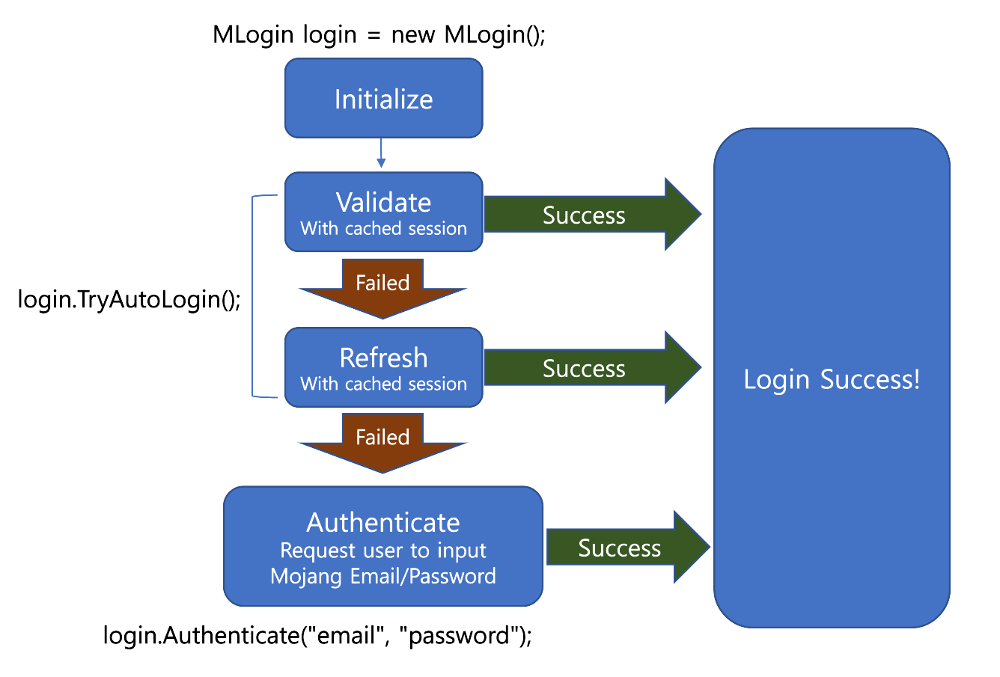

# 예전 모장 계정


이 API 는 사용 불가능합니다! 모장에서 더 이상 예전 계정으로 로그인하지 못하게 API 를 막았습니다.

[Microsoft-Xbox-Live-Login.md](Microsoft-Xbox-Live-Login.md "mention")을 사용하세요.


For legacy mojang account,

* `MLogin` class provides methods to communicate with the Mojang auth server.
* `MLoginResponse` class represents login result. Methods in `MLogin` class return this object.
* `MSession` class represents player's session data, containing `Username`, `UUID`, and `AccessToken`.

_Note:_ [_this document_](https://wiki.vg/Authentication) _will help you to understand basic process of minecraft login._

## Mojang Login

The basic login process is:\


[PremiumLogin() in CmlLibCoreSample](https://github.com/CmlLib/CmlLib.Core/blob/master/CmlLibCoreSample/Program.cs)

```csharp
var login = new MLogin();

// TryAutoLogin() reads the login cache file and check validation.
// If the cached session is invalid, it refreshes the session automatically.
// Refreshing the session doesn't always succeed, so you have to handle this.
Console.WriteLine("Attempting to automatically log in.");
var response = login.TryAutoLogin();

if (!response.IsSuccess) // if cached session is invalid and failed to refresh token
{
    Console.WriteLine("Auto login failed: {0}", response.Result.ToString());

    Console.WriteLine("Input your Mojang email: ");
    var email = Console.ReadLine();
    Console.WriteLine("Input your Mojang password: ");
    var pw = Console.ReadLine();

    response = login.Authenticate(email, pw);

    if (!response.IsSuccess)
    {
        // session.Message contains a detailed error message. It can be null or an empty string.
        Console.WriteLine("failed to login. {0} : {1}", response.Result.ToString(), response.ErrorMessage);
        Console.ReadLine();
        Environment.Exit(0);
    }
}

// The result Session
MSession session = response.Session;

// var launchOption = new MLaunchOption()
// {
//      Session = session,
//      // launch options
// };
```

## MLogin

Provides methods to communicate with the Mojang auth server and cache game session.\
All methods return [#mloginresult](mojang-account.md#mloginresult "mention"). You can get the result of login and result session from `MLoginResponse`.\
This class fully implments [Yggdrasil authentication scheme](https://wiki.vg/Authentication).

### Constructor

#### public MLogin()

Initialize object with default login cache file path. Default path : `Path.Combine(MinecraftPath.GetOSDefaultPath(), "logintoken.json")`

#### public MLogin(string sessionCacheFilePath)

Initializes object and sets `SessionCacheFilePath`.

### Properties

#### SessionCacheFilePath

_Type: string_

SessionCacheFilePath

#### SaveSession

Save session data to `SessionCacheFilePath` if this true. Default value is true.

### Methods

#### public MSession ReadSessionCache()

Returns session from cache file.

#### public MLoginResponse Authenticate(string id, string pw)

Login with Mojang email and password, with cached clientToken.

#### public MLoginResponse Authenticate(string id, string pw, string clientToken)

Login with Mojang email and password.

#### public MLoginResponse TryAutoLogin()

Checks validation of cached session and refresh session if it is not valid session.

#### public MLoginResponse TryAutoLogin(MSession session)

Checks validation of the specified session and refresh session if it is not valid session.

#### public MLoginResponse Refresh()

Refresh session using cached session.

#### public MLoginResponse Refresh(MSession session)

Refresh the specified session.

#### public MLoginResponse Validate()

Validate session with cached session.

#### public MLoginResponse Validate(MSession session)

Validate the specified session.

#### public void DeleteTokenFile()

Delete cached session file. This is the easiest way to logout.

#### public bool Invalidate()

Logout with cached session file.

#### public bool Invalidate(MSession session)

Logout the specified session.

#### public bool Signout(string id, string pw)

Logout using Mojang email and password.

## MLoginResponse

Indicates the login response.

### Properties

#### IsSuccess

_Type: bool_

Returns true if `Result` is `MLoginResult.Success`.

#### Result

_Type:_ [#mloginresponse](mojang-account.md#mloginresponse "mention")

Login Result. If this property is not `MLoginResult.Success`, then `Session` will be null.

#### Session

_Type:_ [.](./ "mention")

Result session.

#### ErrorMessage

_Type: string_

Error message. It is set when the `Result` property is not `MLoginResult.Success`. This property can be empty or a null string when the login result is not successful.

## MLoginResult

Indicates the login result.

### Fields

#### Success

Login successful.

#### BadRequest

#### WrongAccount

#### NeedLogin

#### UnknownError

#### NoProfile

User doesn't purchase minecraft.
